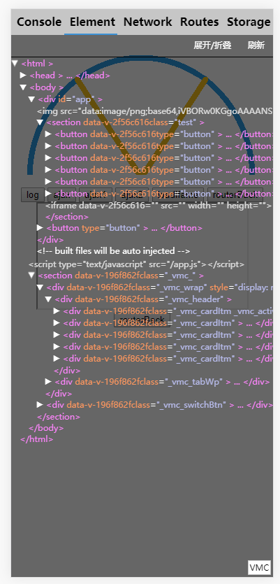
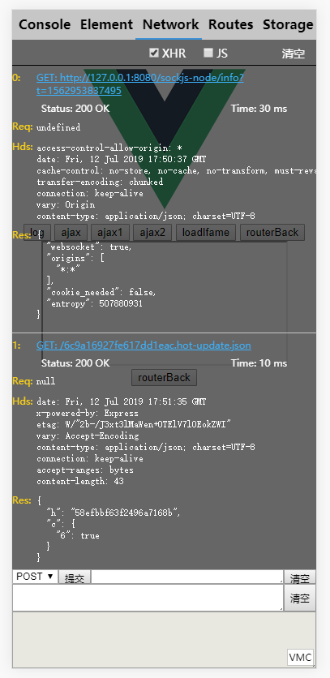
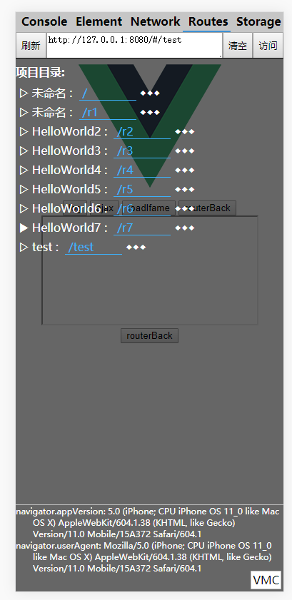
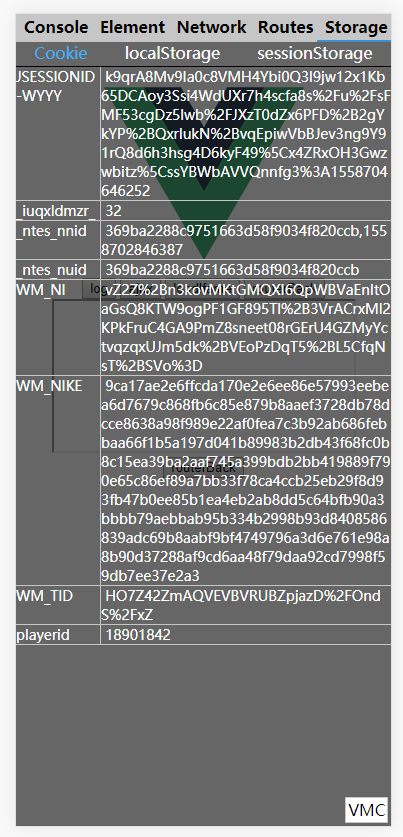

 
<h1>VMConsole</h1>
<h1>Vue Mobile Console: Vue项目移动端调试工具</h1>

安装: 
<pre>
$ npm i -D vmconsole
</pre>

使用: 
<pre>
// import Vue from 'vue';  // 依赖项目中的Vue  
// import router from './router/index.js';  // 依赖项目中的路由 
// import store from './store/index.js';  // 依赖项目中的状态管理 
import VMConsole from "vmconsole/vmc/index.js";  // 引入 VMConsole  
// 初始化 VMConsole 
VMConsole(Vue,router,store); // Vue 必填;  router、store可选  
</pre>

或者按需引入 (如非生产环境引入) 
<pre>
if ( process.env.NODE_ENV!=='production' ) {
   require("vmconsole/vmc/index.js").default(Vue,router,store); 
 }
</pre>

<pre> 注意: 依赖于webpack的打包, 请不要将该包排除在打包范围外; </pre>

 
 
 
 
 

 

