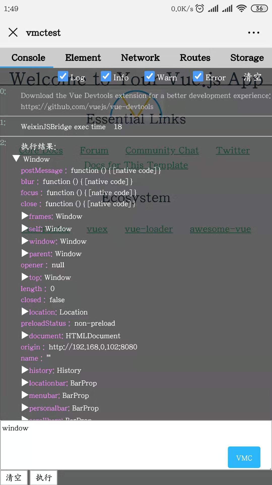
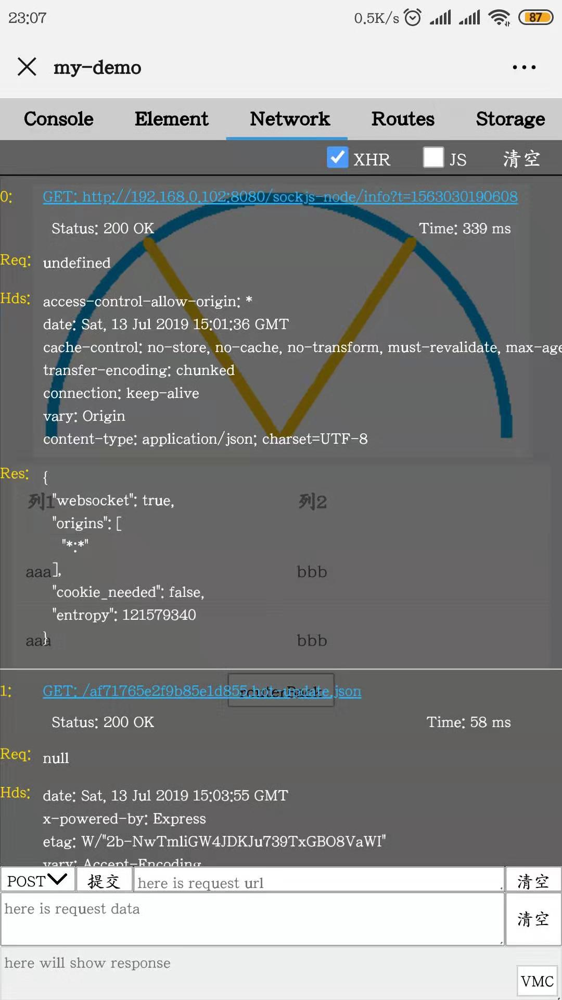
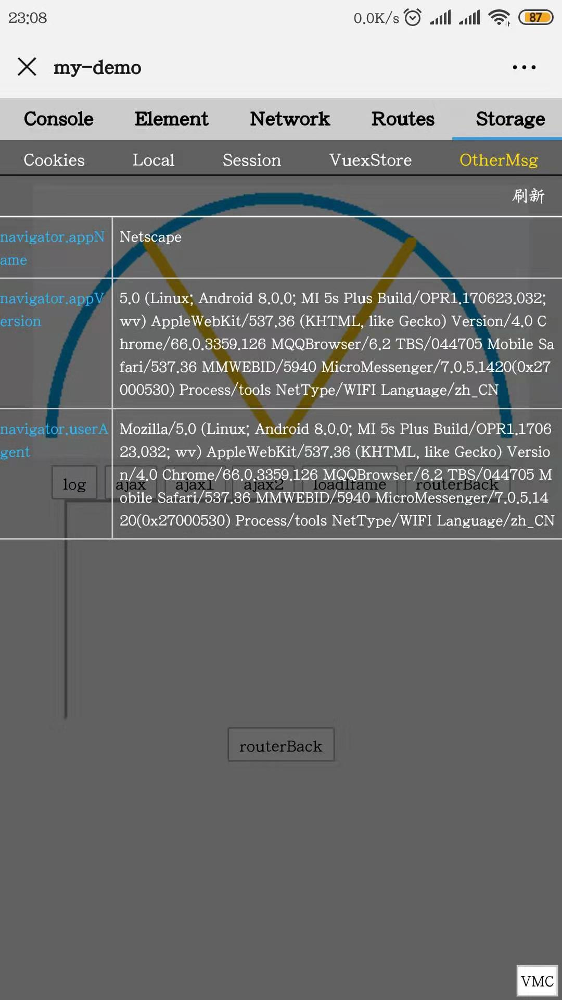

 
<h1>VMConsole</h1>
<h1>Vue Mobile Console</h1>
<h2>Vue项目移动端调试工具</h2>


安装: 
```
$ npm i -D vmconsole
```

使用: 
```
// import Vue from 'vue';                   // 依赖项目中的Vue 
// import router from './router/index.js';  // 依赖项目中的router 
// import store from './store/index.js';    // 依赖项目中的store 
// new Vue({                                // 项目中的Vue实例化 
//   el: '#app',
//   router,
//   store,
//   components: { App },
//   template: '<App/>'
// })

// 引入 VMConsole  
import VMConsole from "vmconsole";  
// 初始化 VMConsole 
VMConsole(Vue,router,store); // Vue 必填;  router、store可选  
```


```
// 或者按需引入 (如非生产环境引入) 
if ( process.env.NODE_ENV!=='production' ) {
   require("vmconsole").default(Vue,router,store); 
 }
```

```
注意: 依赖于webpack的打包, 请不要将该包排除在打包范围外; 
```

 
 
 
 
 
 


 


